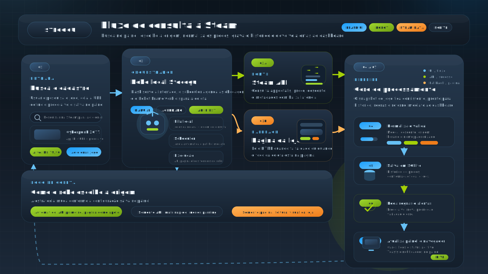

# 🎮 Steam Price Watcher

<p align="center">
  
</p>

Projeto de automação desenvolvido com Python, Flask e Robot Framework para monitoramento de preços de jogos da Steam em uma interface web local com visual inspirado na própria Steam.

A aplicação permite cadastrar jogos de interesse, pesquisar itens na loja, consultar preços automaticamente, registrar histórico e exibir alertas quando um jogo entra em promoção, atinge um preço-alvo ou sofre queda de valor.

---

## 🎥 Demonstração

Vídeo de demonstração da aplicação:

https://github.com/user-attachments/assets/f3659aa0-2b6b-4cc6-9b16-8fd2d68ead3f

---

## 🎯 Objetivo do projeto

Simular um cenário real de automação de coleta e monitoramento de dados externos, integrando:

- Interface web local
- Backend em Python
- Automação com Robot Framework
- Persistência de dados em SQLite
- Regras de alerta baseadas em negócio
- Integração entre coleta, API interna e painel web

---

## 🤖 O que este projeto demonstra em QA/Automação

- Automação de coleta de dados de fonte externa
- Uso de Robot Framework integrado a bibliotecas Python próprias
- Execução automatizada em intervalos configuráveis
- Validação de regras de negócio, como promoção, preço-alvo e queda de preço
- Integração entre automação, backend e interface web
- Persistência de histórico e alertas
- Organização modular do projeto

---

## ⚙️ Funcionalidades reais da aplicação

- Adicionar jogos pelo link da Steam
- Pesquisar jogos diretamente na loja pela interface local
- Atualizar um jogo manualmente
- Executar monitoramento manual de todos os jogos
- Executar monitoramento automático em intervalos configuráveis
- Registrar histórico de preços
- Gerar alertas de promoção, queda de preço e preço-alvo atingido
- Registrar logs do robô para consulta no painel
- Exibir detalhes do jogo, imagens, resumo e dados enriquecidos
- Permitir notificações do navegador quando habilitadas

### Modos de coleta disponíveis

- `automatico`: tenta primeiro a Steam API e usa a página da loja como fallback
- `api`: consulta apenas a Steam API
- `pagina`: consulta apenas o HTML da página da loja

---

## 🧪 Tecnologias utilizadas

- Python
- Flask
- Robot Framework
- SQLite
- Requests
- Beautiful Soup
- HTML
- CSS
- JavaScript

---

## 🚀 Como executar o projeto

### 1. Obter o projeto

Se estiver usando Git:

```bash
git clone <url-do-repositorio>
cd SteamPriceWatcher
```

Ou baixe o projeto e acesse a pasta raiz manualmente.

### 2. Criar ambiente virtual

```bash
python -m venv venv
```

Linux/macOS:

```bash
source venv/bin/activate
```

Windows:

```powershell
venv\Scripts\activate
```

### 3. Instalar dependências

```bash
pip install -r requisitos.txt
```

### 4. Executar a aplicação

```bash
python steampricewatcher.py
```

Ao iniciar, a aplicação:

- lê `dados/configuracao.json`
- escolhe uma porta livre a partir da porta preferida
- inicia o agendador de monitoramento
- abre o navegador automaticamente, se essa opção estiver ativa
- sobe o servidor local Flask

Também é possível sobrescrever a porta preferida com a variável de ambiente:

```bash
PORTA_STEAMPRICEWATCHER=5050
```

No Windows PowerShell:

```powershell
$env:PORTA_STEAMPRICEWATCHER=5050
```

---

## ⚙️ Configuração

As configurações principais do sistema ficam em:

```text
dados/configuracao.json
```

Exemplo atual do projeto:

```json
{
  "porta": 5000,
  "intervalo_minutos": 15,
  "abrir_navegador": true,
  "foco_coleta": "automatico",
  "idioma_loja": "brazilian",
  "pais_loja": "br",
  "timeout_requisicao_segundos": 30,
  "registrar_logs_robot": true,
  "limite_logs_robot": 40,
  "notificacoes_navegador_ativas": false
}
```

Campos suportados:

- `porta`
- `intervalo_minutos`
- `abrir_navegador`
- `foco_coleta`
- `idioma_loja`
- `pais_loja`
- `timeout_requisicao_segundos`
- `registrar_logs_robot`
- `limite_logs_robot`
- `notificacoes_navegador_ativas`

### Observações importantes sobre a configuração atual

- `foco_coleta` aceita `automatico`, `api` e `pagina`
- `timeout_requisicao_segundos` tem mínimo de 5 segundos
- `limite_logs_robot` é limitado entre 10 e 200
- `idioma_loja` atualmente é validado apenas como `brazilian`
- `pais_loja` atualmente é validado apenas como `br`

---

## 🔄 Fluxo real do sistema

1. O usuário executa `steampricewatcher.py`.
2. A aplicação cria o app Flask e carrega configuração, armazenamento, serviço e agendador.
3. O sistema escolhe uma porta disponível e inicia o monitoramento agendado.
4. O usuário pode pesquisar um jogo na Steam ou adicionar um link manualmente.
5. Ao adicionar ou atualizar um jogo, o Robot Framework executa a coleta.
6. A biblioteca Python do robô tenta buscar o preço pela API ou pela página, conforme o foco configurado.
7. O resultado é salvo no SQLite, junto com histórico, alertas e logs.
8. O painel consome os endpoints JSON e exibe jogos, alertas, logs e status do monitoramento.

<p align="center">
  
</p>

---

## 🔌 API JSON

O projeto disponibiliza endpoints JSON usados pela interface e também úteis para integração local.

### `GET /api/painel`

Retorna o estado principal do painel, incluindo:

- jogos monitorados
- alertas recentes
- logs do robô
- configuração atual
- status do monitoramento
- porta em uso
- resumo do projeto

### `GET /api/steam/busca`

Busca jogos na loja da Steam a partir de um termo.

Parâmetros:

- `termo`: obrigatório, mínimo de 2 caracteres
- `limite`: opcional, entre 1 e 25

Observação: esta busca usa o endpoint de resultados da Steam e processa o HTML retornado.

### `GET /api/logs-robot`

Retorna logs do robô com paginação.

Parâmetros:

- `limite`
- `offset`

### `POST /api/jogos`

Adiciona um jogo ao monitoramento.

Campos aceitos:

- `url`
- `preco_alvo`

Ao adicionar, a aplicação já executa uma coleta inicial para salvar o jogo com dados reais.

### `POST /api/jogos/<id>/atualizar`

Atualiza imediatamente um jogo já monitorado.

### `GET /api/jogos/<id>/historico`

Retorna o histórico de preços do jogo.

Atualmente o histórico é retornado com limite padrão de 30 registros no backend.

### `DELETE /api/jogos/<id>`

Remove o jogo do monitoramento e apaga também:

- histórico
- alertas relacionados
- logs do robô associados ao jogo

### `POST /api/monitoramento/executar`

Dispara manualmente um ciclo de monitoramento para todos os jogos.

Comportamento atual:

- retorna `202` quando a execução é iniciada
- retorna `409` se já existir um monitoramento em andamento

### `GET /api/configuracao`

Retorna a configuração atual da aplicação.

### `PUT /api/configuracao`

Atualiza a configuração da aplicação com os campos suportados pelo backend.

---

## 📁 Estrutura real do projeto

```text
SteamPriceWatcher/
├── steampricewatcher.py
├── README.md
├── requisitos.txt
├── aplicacao/
│   ├── armazenamento.py
│   ├── configuracao.py
│   ├── executor_robot.py
│   ├── formatacao.py
│   ├── monitoramento.py
│   ├── servico_steam.py
│   ├── servidor.py
│   └── servidor_local.py
├── assets/
│   ├── css/
│   │   └── estilo.css
│   ├── imagens/
│   │   ├── favicon-stecogu.png
│   │   ├── logo-stecogu.png
│   │   └── svg/
│   │       └── stecogu.svg
│   └── js/
│       └── painel.js
├── dados/
│   ├── configuracao.json
│   ├── steampricewatcher.db
│   └── saidas_robot/
├── paginas/
│   └── pagina_inicial.html
└── robos/
    ├── coletar_preco_steam.robot
    └── bibliotecas/
        └── biblioteca_steam.py
```

---

## 🤖 Papel real do Robot Framework no projeto

O Robot Framework funciona como camada de orquestração da coleta.

No estado atual do projeto, ele não usa navegador para buscar preços. Em vez disso, a task chama a biblioteca Python `robos/bibliotecas/biblioteca_steam.py`, que faz as consultas com `requests` e, quando necessário, interpreta o HTML com Beautiful Soup.

Esse fluxo permite:

- padronizar a execução da coleta
- registrar logs da automação
- separar a lógica de consulta da lógica do backend Flask
- alternar entre coleta via API e coleta via página

---

## 💾 Dados armazenados

O projeto mantém os dados em SQLite e em arquivos locais.

### Banco de dados

Arquivo:

- `dados/steampricewatcher.db`

Tabelas usadas atualmente:

- `jogos`
- `historico_precos`
- `alertas`
- `logs_robot`

### Arquivos auxiliares

- `dados/configuracao.json`
- `dados/saidas_robot/`

Os arquivos de saída do robô são usados durante a coleta e o JSON temporário é removido após a leitura pelo executor.

---

## 🔮 Melhorias futuras

- Notificações por e-mail
- Dashboard com gráficos de preço
- Filtros e ordenação ainda mais avançados
- Exportação de histórico
- Containerização com Docker
- Integração com CI/CD
- Testes automatizados para a API e para o fluxo de coleta

---

## 📝 Observações

- O link informado precisa ser da loja da Steam
- Links do tipo `/app/{id}` funcionam melhor para o modo `api`
- O projeto depende da disponibilidade da Steam e da estrutura atual dos dados retornados por ela
- Mudanças no HTML da loja ou na resposta da API podem exigir ajustes na coleta
- Todo o fluxo roda localmente

---

## 👩‍💻 Autora

Wanessa Alves
